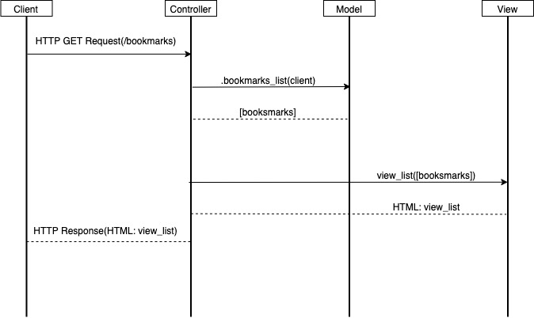

# Bookmark Manager
---------

### Overview

Makers Acadamy pairs programming project.

### How to install

Clone or download repo

#### To set up the database

Connect to `psql` and create the `bookmark_manager` database:

```
CREATE DATABASE bookmark_manager;
```

To set up the appropriate tables, connect to the database in `psql` and run the SQL scripts in the `db/migrations` folder in the given order.

----------
### Client Requirements
```
As a user
So I can go to sites I like
I would like to see a list of bookmarks
```
```
As a user
So I can update my list of bookmarks
I would like to be able to add bookmarks to my manager
```
```
As a user
So I can update my list of bookmarks
I would like to be able to delete bookmarks to my manager
```
```
As a user
So I can update my list of bookmarks
I would like to be able to modify bookmarks to my manager
```
```
As a user
So I know why I added a bookmark
I would like to be able to comment on bookmarks in my manager
```
```
As a user
So I can organise my bookmarks
I would like to be able to tag bookmarks into categories
```
```
As a user
So I can organise my bookmarks
I would like to be sort by bookmarks by tag
```
```
As a site admin
So clients don't get confused
I would like to restrict users to manage only their bookmarks
```

### Process Diagrams




### Objects
- Controller: app_controller
- Model: bookmark_manager
- View: view_bookmark
